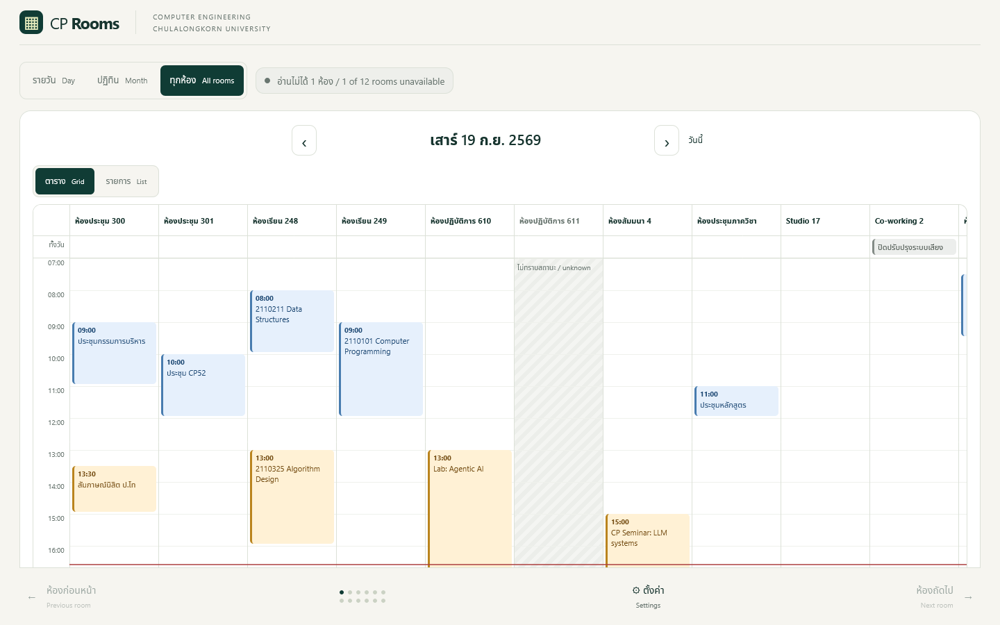
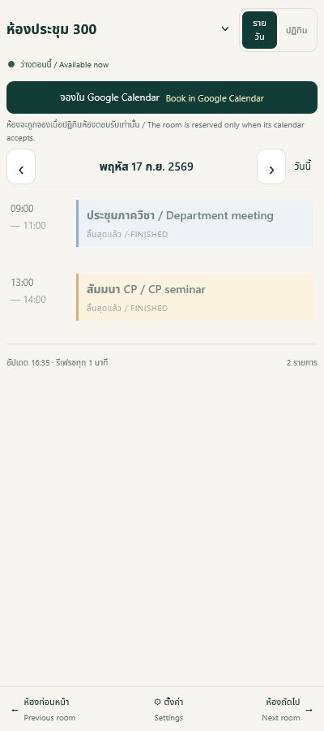
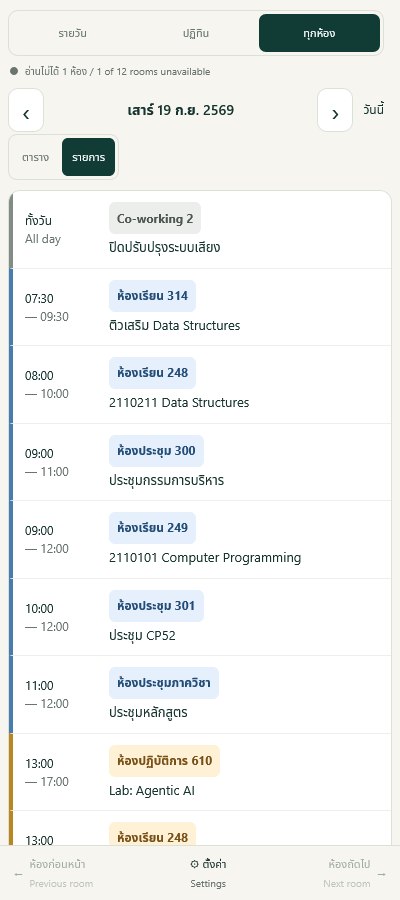

# CP Rooms

A mobile-first, read-only viewer for Google Workspace **room resource calendars**.
It answers the question people actually have — *is this room free right now, and what
is in it today?* — in two taps, using each person's own Google permissions.

Built for the Department of Computer Engineering, Chulalongkorn University, and running
at <https://room.cp.eng.chula.ac.th>. Nothing in it is specific to that department
beyond configuration.



*Screenshots use invented bookings and room names.*

## Why it exists

Google Calendar shows room resources well enough once you are already inside an event.
It is poor at the everyday questions: which of our twelve rooms is free at 2 pm, what is
running in the seminar room this afternoon, and which rooms does the operations team need
to prepare tonight. Those questions get asked from a phone, in a corridor, by people who
should not need to learn Google Calendar's room picker.

This is a small Django app that answers them, and deliberately does almost nothing else.

## What it does

- **Day view** — one room's schedule for a day, with previous/next room, swipe
  navigation, and a date picker.
- **Month view** — a Monday-first calendar; tap a day to read its bookings below the grid.
  Width and text size are adjustable for small screens.
- **All rooms view** — one day across every configured room, either as a grid with the
  rooms across and the hours down, or as a single time-ordered list. Built for the people
  who prepare the rooms rather than book them.
- **Availability now** — merges overlapping and back-to-back bookings, so "busy until
  15:00" means it, and handles all-day, transparent and cancelled events separately.
- **Booking**, for the people allowed to do it — a button that opens Google Calendar's own
  create-event screen, pre-filled with the room, the day and the first free hour. The app
  itself never writes to a calendar.
- **Honest failure** — stale data, a network failure or a permission failure all show as
  *availability unknown*. A room that cannot be read is never drawn as a free room.
- Bilingual Thai/English interface, Asia/Bangkok throughout, no external requests from the
  browser, and a full-screen mode where the browser allows it.

<p align="center">
  
  
</p>

## How permissions work

This is the part worth reading before deploying it anywhere.

- **Every person signs in as themselves.** There is no service account and no domain-wide
  delegation, so the app can never show anyone a calendar they could not open in Google
  Calendar themselves.
- **One read-only scope**: `openid`, `email`, and
  `https://www.googleapis.com/auth/calendar.events.readonly`.
- **Organization membership is verified, not assumed.** The backend checks the signed ID
  token, the verified email flag, the exact email domain, and Google's hosted-domain
  claim, rather than trusting what the account picker showed.
- **Booking is gated on Google's own answer.** Google reports each person's access level
  on each room calendar; only `writer` ("Make changes to events") and `owner` are offered
  the button, because in this department a small group books on everyone else's behalf.
  Widen it to `reader` in `BOOKING_ROLES` (`viewer/google.py`) if your rooms are
  self-service. It is a courtesy gate, not enforcement — Google decides what a booking
  attempt actually does.
- **Room calendar IDs never reach the browser.** The page and the JSON responses carry
  room keys and names only; the booking link is assembled server-side by `/book`, which
  redirects. Four tests keep it that way.
- **Tokens are encrypted at rest** with Fernet, sessions are HttpOnly/Secure/SameSite=Lax,
  calendar responses are `no-store`, and there is no offline cache or service worker.

## Requirements

- Python 3.12 or newer (developed on 3.14) — Django 5.2, Authlib, Requests, Gunicorn;
  exact pins in `requirements.txt`
- A Google Cloud project with the **Google Calendar API** enabled and an OAuth client of
  type *Web application*, audience Internal
- Google Workspace **resource calendars** for the rooms, shared with the people who should
  see them

## Setup

```bash
python3 -m venv .venv
.venv/bin/pip install -r requirements.txt
.venv/bin/python scripts/configure.py /path/to/oauth-client.json             # local
.venv/bin/python scripts/configure.py /path/to/oauth-client.json --production
cp rooms.example.json rooms.json          # then put your own calendar IDs in it
chmod +x dev.sh
./dev.sh                                  # http://127.0.0.1:8000
```

`scripts/configure.py` creates `.private/local/` and `.private/production/`, each with its
own generated Django secret key and token-encryption key. It refuses to overwrite an
existing configuration. **Never replace a production token-encryption key casually**:
tokens already saved can only be decrypted with the key that wrote them.

Register the callback for whichever host you run on, in the Google Cloud console:

```text
http://127.0.0.1:8000/auth/google/callback        # local development
https://your-host.example/auth/google/callback    # production
```

### Configuration

`.private/<environment>/config.json`:

| Key | Meaning |
|---|---|
| `public_url` | Base URL the app builds its OAuth callback from |
| `allowed_hosts` | Django's `ALLOWED_HOSTS` |
| `org_domain` | The only email domain allowed to sign in |
| `allowed_hosted_domains` | Accepted Google hosted-domain claims; usually just `org_domain` |
| `google_credentials` | Path to the OAuth client JSON |
| `secret_key`, `token_encryption_key` | Generated; back them up with the database |
| `data_dir` | Where `db.sqlite3` lives |
| `debug` | Local only |

`rooms.json` lists the rooms, in display order. Each entry needs a stable unique `key` and
the resource's `calendar_id`. `name` overrides the label; `null` loads the calendar's own
title from Google, cached ten minutes per signed-in person.

```json
[
  {"key": "room-300", "name": "ห้องประชุม 300", "calendar_id": "RESOURCE_ID@resource.calendar.google.com"},
  {"key": "room-248", "name": null, "calendar_id": "ANOTHER_RESOURCE_ID@resource.calendar.google.com"}
]
```

Share each room calendar with your organization as **See all event details** if staff
should see booking titles; free/busy-only sharing hides them and may prevent this viewer
from listing events at all.

## Running it in production

Gunicorn behind a reverse proxy that terminates TLS, plus `collectstatic` and Django's
`check --deploy`. The deployment scripts for the department's own server are not part of
this repository, because they carry that network's addresses; the shape is a release
directory per deploy, a symlink switch, a systemd unit, and a health check that rolls back
on failure.

## Tests

```bash
export ROOM_CALENDAR_CONFIG="$PWD/.private/local/config.json"
.venv/bin/python manage.py test
node --check static/app.js
```

The tests mock Google. A real sign-in and consent test is still required after deploying,
because automated tests cannot prove that consent, scopes and calendar sharing are right.

Common problems:

- **redirect_uri_mismatch** — the exact callback above is not registered on the OAuth client.
- **Organization rejected** — the account's email domain or hosted-domain claim does not
  match `org_domain` / `allowed_hosted_domains`.
- **Calendar access unavailable** — the Calendar API is disabled, Workspace policy blocks
  the app, or that person cannot read that room's events.
- **Reconnect** — consent or refresh access was revoked or expired; sign in again.

## Layout

```text
room_calendar/   Django project (settings, urls, wsgi)
viewer/          The app: views, Google integration, encrypted token model, tests
templates/       index.html and error.html
static/          Vanilla JavaScript and CSS, Noto Sans Thai
scripts/         configure.py (key generation), static build config, database backup
```

The frontend is deliberately vanilla JavaScript and CSS — no build step, no framework, and
calendar data is written with `textContent` rather than HTML.

## License

MIT — see [LICENSE](LICENSE).

## Credits

Noto Sans Thai is bundled under the SIL Open Font License; see `static/fonts/LICENSE.txt`.

- [Google OpenID Connect](https://developers.google.com/identity/openid-connect/openid-connect)
- [Calendar events.list](https://developers.google.com/workspace/calendar/api/v3/reference/events/list)
- [Authlib Django integration](https://docs.authlib.org/en/v1.7.0/oauth2/client/web/django.html)
